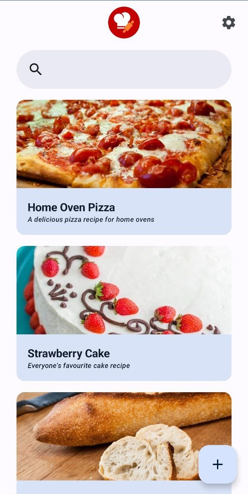

# Baker's Recipes

 
Baker's Recipes is a recipe book app for Android using Baker's Percentages. 

It allows users to create scalable recipes inserting recipes by weight or percentage.

Baker's Recipes is built with Android Architecture Components (Room, LiveData, ViewModel) following the MVVM design pattern.

## Third Party Libraries
 * Android Architecture Components
    * LiveData
    * Room
    * ViewModel
 * Glide

## License

This project is licensed under the GPLv3 License - see the [LICENSE](LICENSE) file for details.
